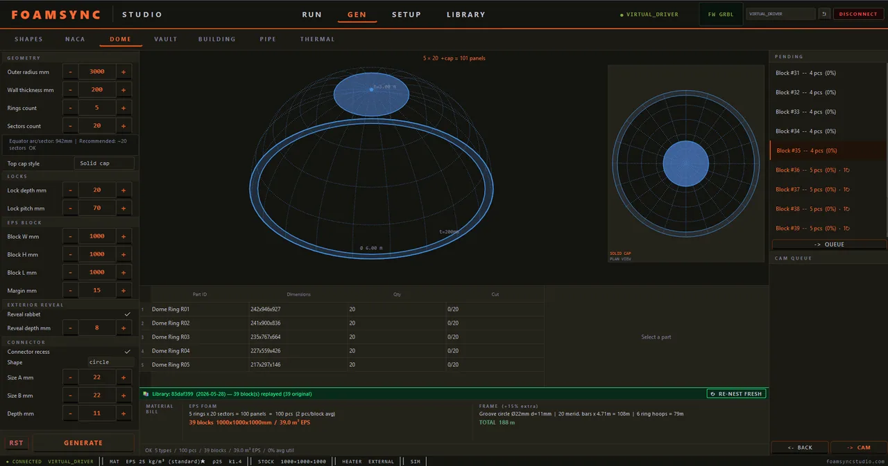
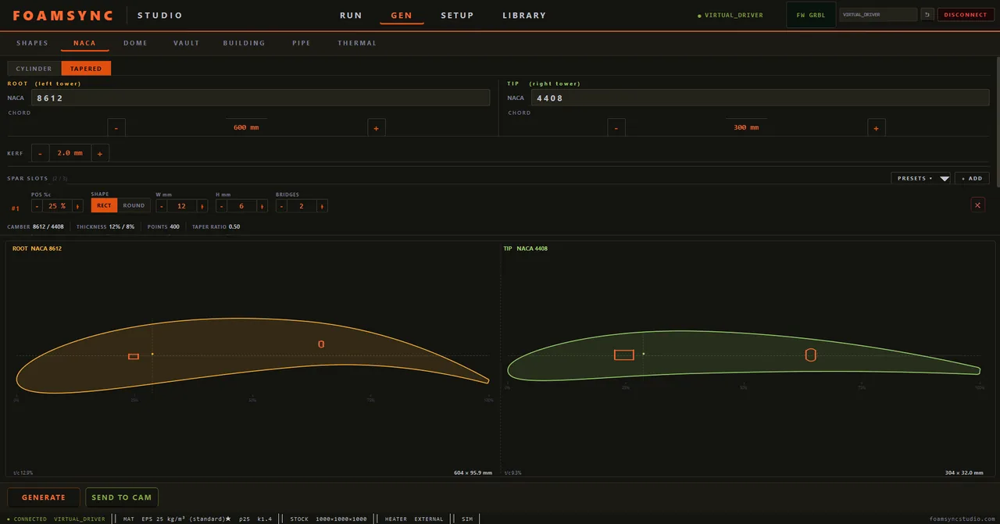
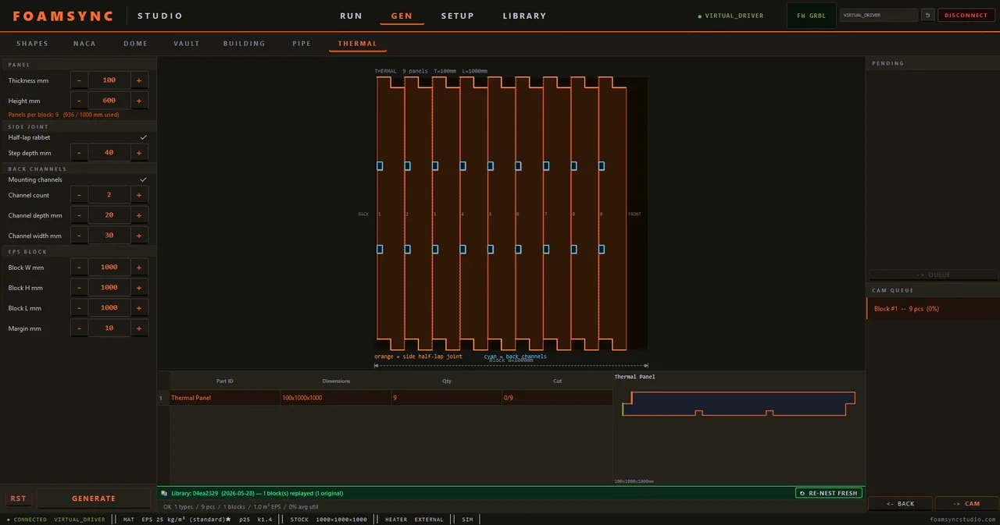

# FoamSync

### Production 4-axis CAM for hot-wire EPS foam cutting

**From sketch to clean G-code in one tool — generate the shape, nest it automatically, cut it precisely.**

[**Download**](../../releases/latest) · [**Website**](https://foamsyncstudio.com) · [**Docs**](docs/introduction.md) · [**FAQ**](docs/faq.md)

---

## What is FoamSync?

FoamSync turns a hot-wire foam cutter into a precision production tool. Instead of hand-drawing every profile and fighting with raw G-code, you **generate the shape parametrically**, let the **cut-safe nester** pack it into your stock, and send a clean, **kerf-compensated 4-axis toolpath** to the machine — or simulate the whole job first on the built-in **virtual machine**.

Built for the shops that cut EPS / XPS / PU every day: architectural décor, RC and aero foam cores, and thermal insulation.

> The point is time. A parametric generator collapses the hours normally spent preparing and converting profiles down to minutes — so the work shifts back to where it belongs: actually cutting parts.

## Highlights

- ⚙️ **Parametric generators** — domes, vaults, walls, cornices, NACA airfoils, pipe shells, thermal panels. Minutes, not hours.
- 🪛 **4-axis cutting** (with 5th rotary-axis support) — independent X/Y and U/V towers for tapered and twisted parts.
- 🧩 **Auto-nesting** — collision-aware packing across every generator, with continuous, clean cut paths.
- 🖥️ **Virtual machine** — preview and validate the full cut before touching real foam.
- 🎛️ **Real-machine control** — live DRO, jog, heater control (PWM / PID), one-tap wire-zero.
- 🪶 **Cut quality built in** — per-material calibrated feed and curvature-adaptive corner slowdown.
- ✏️ **Freehand Grid editor** — draw any custom contour (snap grid, curved edges, holes, trace-over-image) and save it to your own library.
- 📐 **SVG / DXF import** — bring in profiles you already have.

## Generators

### 🏛 BUILD — architectural
Dome (radial / oculus / top-cap), Vault (custom span & height), building-block walls with rounded-corner openings, and a Cornice generator for decorative moulding profiles.

### ✈️ AERO — 4-axis airfoils
NACA-4 airfoil (any chord / thickness), spar-slot cut-outs with bridge support, 4-axis tilted cuts, and cylindrical or tapered wings with independent **root + tip** profiles.

### 🔥 THERMAL — insulation
Pipe-shell unfolder for cylindrical jackets, and a thermal-panel stack-nester.

### Always included
**Grid Sketch** (freehand contour editor + saved-shape library), primitive **Shapes**, and **SVG / DXF import** — on every edition, including Lite.

## Editions

| | **Lite** | **Pro** | **Studio** |
|---|:---:|:---:|:---:|
| CAM core · real machine · virtual simulation | ✓ | ✓ | ✓ |
| SVG/DXF import · Grid Sketch · Shapes | ✓ | ✓ | ✓ |
| Parametric generators | — | add packs | all included |
| Machine seats | 1 | 1 | 3 |
| Customer CRM · priority support | — | — | ✓ |

**Pro** adds the **BUILD / AERO / THERMAL** packs à la carte — buy only the workflows you need. Each Lite and Pro licence can be monthly, annual, or a one-time perpetual key; Studio is subscription. Current pricing → **[foamsyncstudio.com](https://foamsyncstudio.com)**.

## Try it

Download the latest installer from [**Releases**](../../releases/latest) and run the **7-day trial** — a full feature preview in virtual (no-machine) mode, output watermarked, no payment required. Activate a licence to unlock real-machine output and remove the watermark.

**Requirements:** Windows 10 / 11, 64-bit. See [installation](docs/installation.md) and [hardware & wiring](docs/hardware.md).

## Documentation

| | |
|---|---|
| [Introduction](docs/introduction.md) | [Features](docs/features.md) |
| [Workflow](docs/workflow.md) | [Tiers & packs](docs/tiers-and-packs.md) |
| [Virtual machine](docs/virtual-machine.md) | [Hardware & wiring](docs/hardware.md) |
| [Installation](docs/installation.md) | [Activation](docs/activation.md) |
| [FAQ](docs/faq.md) | [Support](docs/support.md) |

## Support

Questions, licences, onboarding → **[foamsyncstudio.com](https://foamsyncstudio.com)** · or see [support](docs/support.md).

---

**© 2026 Balcore Systems** · Mörfelden-Walldorf, Germany · FoamSync™

This repository hosts public documentation and signed release downloads. FoamSync is proprietary software — see [LICENSE](LICENSE.md).

