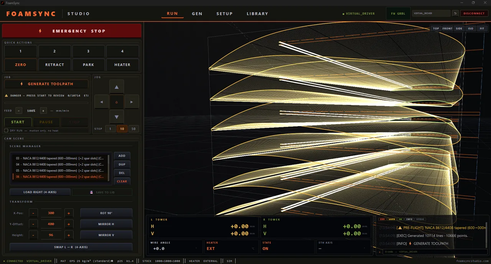

# FoamSync

CAM software for 4-axis hot-wire CNC foam cutters. Built by
[Balcore Systems](https://foamsyncstudio.com), Frankfurt am Main.

[Website](https://foamsyncstudio.com)
&nbsp;·&nbsp;
[Download](https://foamsyncstudio.com/download/)
&nbsp;·&nbsp;
[Buy](https://t.me/FoamSync_bot)
&nbsp;·&nbsp;
[Manual](https://foamsyncstudio.com/docs/)

  

---

## Overview

FoamSync lets a single operator run a 4-axis hot-wire foam-cutting
shop without an engineering office, a CAM specialist, or an IT
department. Domes, vaults, rounded buildings, NACA wings, pipe
shells, thermal panels — and anything you can draw as an SVG — are
parametric input on one side and a finished G-code program running on
the machine on the other, all in the same window.

The product is built for production-floor operators across a wide
range of work: architectural foam (domes, vaults, walls, openings),
aerospace/RC (NACA wings with spar slots, tapered profiles),
industrial insulation (pipe shells, thermal panels with mounting
channels), and custom shapes from SVG. It controls the machine
directly — no separate sender, no export round-trip between tools.

## What it includes

- Parametric generators: domes, vaults, building-block walls, NACA-4
  airfoils with spar slots, pipe shells, and thermal panels.
- 4-axis G-code post-processor with synced X/Y on one tower and
  independent U/V on the other.
- Auto-nesting that operates on the union of top and bottom contours
  (so tilted 4-axis sweeps pack correctly), with cluster strategies
  per generator family.
- Collision check and a pre-cut wire-safety validation pass.
- In-window machine control: 4-axis DRO with optional 5th rotational
  axis, on-screen jog, emergency stop, quick actions (zero / retract /
  park / heater), live feed override.
- Heater control: external, board PWM, or board PID.
- Material library with kerf, feed, and temperature presets that
  calibrate to the actual foam batch.
- SVG import for arbitrary 2D profiles.
- Diagnostic export the operator can send to support.
- Controller auto-detect for Marlin, GRBL, and GRBL-H-Par.
- **Virtual machine (Virtual GRBL)** — a built-in, behaving virtual
  4-axis cutter that runs the full workflow with no hardware connected.

## What sets it apart

The hot-wire CAM landscape is typically a patchwork of separate tools
— a CAD modeller, a CAM that doesn't really know about hot wire, a
post-processor, and a machine sender — and most shops need at least a
part-time CAD/CAM specialist to keep that pipeline running. FoamSync
collapses the pipeline into one window and replaces the modelling
step with parameter forms, so the operator on the floor can produce
the part without a back-office.

- **Virtual machine (Virtual GRBL) — design and verify before any
  hardware.** Select the virtual driver instead of a COM port and the
  whole app behaves as if a real 4-axis cutter is connected: it homes,
  jogs with smooth motion, runs the full G-code job with the wire
  animating along the real path, honours live feed override, simulates
  the heater, and runs the wire-safety pass — with no machine attached.
  Most hot-wire CAM offers at most a static toolpath preview; this is a
  behaving machine. Evaluate the product, build a part library, and
  train operators before the cutter is even on the floor. See
  [docs/virtual-machine.md](docs/virtual-machine.md).
- **Single-window workflow.** From drawing or parametric input to a
  running G-code program, with the machine connected, in one window.
- **Architectural generators included.** Domes (radial, with solid /
  oculus / no top-cap), barrel vaults, and building-block walls with
  rounded openings — first-class, not retrofitted.
- **4-axis as a primary mode.** Independent X/Y vs U/V tower motion is
  the default model, not a post-processor afterthought; tapered wings
  and tilted sweeps are normal output.
- **Pre-cut wire-safety pass.** Before every cut, the path is checked
  against the machine's wire lean limit with explicit warning /
  danger / critical thresholds and diagnostics.
- **Built-in heater control.** Pick external, board PWM, or board
  PID per machine.
- **Material library that calibrates to your batch.** Kerf, feed, and
  temperature are stored per material grade and adjusted from a small
  reference cut so the next run starts from real behaviour.
- **Nesting that understands 4-axis sweeps.** The packer uses the
  union of top and bottom profiles, and shelves BUILD parts in stacked
  rows; pipe shells use a pair-interlock pattern that fits two
  half-shells into one full circle's footprint.
- **One-tap wire-zero.** Set the wire origin from the current position
  in one click.
- **Multi-firmware auto-detect.** Marlin, GRBL, and GRBL-H-Par
  controllers are recognised on connect.

## Screenshots

  
  
  

More on the [website gallery](https://foamsyncstudio.com/#in-action).

## Tiers and packs

Three tiers (Lite, Pro, Studio) and three Pro Packs you mix on Pro
(BUILD, AERO, THERMAL). The CAM core ships with every tier; packs add
parametric generators. Full feature matrix and current prices on the
[pricing page](https://foamsyncstudio.com/pricing/); summary in
[docs/tiers-and-packs.md](docs/tiers-and-packs.md).

## Get started

1. Download for Windows 10 / 11 (x64) from
   [foamsyncstudio.com/download](https://foamsyncstudio.com/download/).
2. Install and launch. The first seven days run in trial mode: every
   feature is previewed, output is for evaluation, real machines run
   in virtual mode.
3. Buy a licence via [@FoamSync_bot](https://t.me/FoamSync_bot) and
   activate — online, or by loading a licence file from your
   distributor.

Step-by-step: [docs/installation.md](docs/installation.md) ·
[docs/activation.md](docs/activation.md).

## Documentation

- [Introduction](docs/introduction.md) — what FoamSync is and who
  it is for.
- [Virtual machine (Virtual GRBL)](docs/virtual-machine.md) — design,
  dry-run, and verify a full job before connecting any hardware.
- [Installation](docs/installation.md) — requirements, install,
  first launch.
- [Activation](docs/activation.md) — get a key, activate online or
  offline.
- [Tiers and packs](docs/tiers-and-packs.md) — feature matrix per
  tier.
- [Features](docs/features.md) — capability reference.
- [Workflow](docs/workflow.md) — a typical production walkthrough.
- [Supported hardware](docs/hardware.md) — controllers, firmware,
  machine topology.
- [Market context](docs/market-context.md) — where FoamSync sits.
- [FAQ](docs/faq.md)
- [Support](docs/support.md)

The full operator manual lives at
[foamsyncstudio.com/docs](https://foamsyncstudio.com/docs/).

## Support

- Bug reports and feature requests:
  [GitHub Issues](https://github.com/Balcore-Systems/foamsync/issues)
- Activation and billing:
  [@FoamSync_bot](https://t.me/FoamSync_bot)
- Email: <support@foamsyncstudio.com>

## Licence

FoamSync is proprietary, closed-source software. The source is not
published. This repository hosts the public documentation and the
issue tracker. See [LICENSE.md](LICENSE.md).

---

© 2026 Balcore Systems · FoamSync™ · Frankfurt am Main, Germany.
