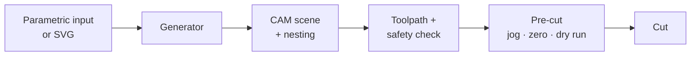

# Workflow

A typical session, from drawing or parametric input to a finished
cut. Times below are illustrative; production scales with part size
and complexity.

## 1. Set up the machine (once)

Open **SET → MACHINE** and enter:

- **Controller** — leave on **Auto (detect on connect)** for most
  users.
- **Tower distance (Z)**, **rail length (X)**, **maximum height (Y)**
  — your machine's physical envelope, in mm.
- **Motion** — cut, travel, and return speeds; logic mode; approach
  clearance.
- **Wire and heater** — wire length, maximum wire angle, heater
  mode.
- **5th axis** — enable only if your machine has a rotary axis.

Save once; the values persist.

## 2. Calibrate the machine (once, plus when material changes)

Open **DIAG → STATUS** and step through **Quick Lab**:

1. **STATUS** — driver and firmware report green.
2. **SETUP CHECK** — pre-flight checklist confirmed.
3. **MOTION TEST** — square, travel limits, backlash.
4. **WIRE CAL** — cut a reference cube, measure eight points with
   calipers, save the kerf.
5. **MATERIAL CAL** — cut a small reference at the catalogue
   settings, score the result, save adjustments to the active
   material preset.

Quick Lab persists between sessions; resume where you left off.

## 3. Pick a generator

On the **GEN** page, choose the tab for the part:

- **SHAPES** — primitives or SVG import (every tier).
- **NACA** — airfoils and tapered wings (AERO pack).
- **DOME / VAULT / BUILDING** — architectural (BUILD pack).
- **PIPE / THERMAL** — insulation (THERMAL pack).

Set the parameters. The 2D and 3D previews update as you type; every
field has a tooltip.

## 4. Generate the parts

Press **GENERATE**. The preview shows the cut profiles and, for
4-axis generators, the resulting geometry in 3D.

Press **SEND TO CAM** (or **→ CAM**). FoamSync hands the parts to
the CAM scene.

If the CAM scene already has parts, FoamSync asks
**REPLACE / ADD / CANCEL**:

- **REPLACE** clears the scene and loads only the new block.
- **ADD** keeps the existing parts and consolidates the new block
  onto the same physical foam block.
- **CANCEL** leaves CAM untouched.

## 5. Lay out and nest

On the **CAM SCENE** panel, position the parts:

- **X-Pos, Y-Offset, Height** — coarse positioning.
- **ROT 90, MIRROR H, MIRROR V** — orientation.
- **SWAP L ↔ R** for 4-axis parts when the towers should swap roles.

Press **RE-NEST** to auto-nest on the foam block. Per-generator
strategies (shelf-row stacking for BUILD parts, pair-interlock for
pipe shells) pack tighter than single-part nesting.

## 6. Check the path

Press **GENERATE TOOLPATH**. The 3D viewport fills with the dense
wire trajectory and the **JOB** status updates:

- **READY** — clean path; line and point counts and an ETA appear.
- **⚠ DANGER — PRESS START TO REVIEW** — a check (typically wire
  angle) wants your attention. Review before cutting.

The 3D view also shows:

- **Translucent red boxes** at any overlapping parts (collision
  check). Resolve by moving or re-nesting.
- The **wire-safety report**, opened at any time, with status, max
  angle, and violation counts.

## 7. Pre-cut

Before pressing START:

1. **Connect** the controller (CONNECT in the top bar). Watch for
   `[OK] Connected` and the firmware badge.
2. **Home** the machine.
3. **Zero** the wire — jog to your stock origin or use **ZERO**
   (Quick Actions).
4. **DRY RUN** — tick the box, then START. The machine traces the
   full path cold; confirm it stays on the stock and clears the
   towers.
5. Bring the wire to temperature for your material — External: set
   it by hand; PWM or PID: FoamSync drives it.

## 8. Cut

Press **START**.

During the cut:

- The DRO shows live tower positions.
- The wire-angle gauge warns as the wire approaches its safe lean
  limit.
- The log streams events.
- **FEED %** overrides the rate live (slow through a tricky section
  without regenerating).
- **PAUSE** holds motion; **STOP** ends the job.

The **EMERGENCY STOP** bar is always visible.

## 9. After the cut

- Inspect edges, kerf, and surface. If anything is off, re-run
  **WIRE CAL** or **MATERIAL CAL**.
- Save the scene to your library if you'll repeat the job.
- Park the machine; let the wire cool before unloading.

## Next

- [Features](features.md)
- [Supported hardware](hardware.md)
- [FAQ](faq.md)
